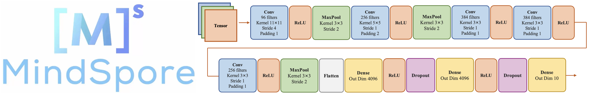

# **基于MindSpore框架的AlexNet案例实现**

    
     
    

  
## **Notebook 内容**
****
### **1 论文讲解**
#### **1.1 论文概述**
#### **1.2 数据集**
#### **1.3 模型讲解**
#### **1.4 模型特点**
#### **1.5 降低过拟合**
#### **1.6 模型参数** 
 

### **2 案例实现**
#### **2.1 环境准备与数据读取**
#### **2.2 数据集处理**
#### **2.3 模型构建**
#### **2.4 训练和测试函数的定义**
#### **2.5 模型训练及评估**
#### **2.6 模型预测**
 

### **3 总结**